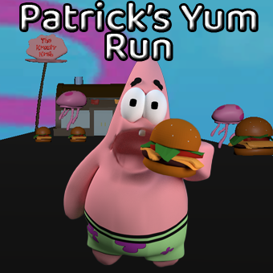

# Patrick's Yum Run

    
**Unity WebGL Game**
 
Author: **Andrew Rodriguez**
---
### Table of Contents
- [Description](#description)
- [How To Use](#how-to-use)
- [Video Walkthrough](#video-walkthrough)
- [User Stories](#user-stories)
- [Author Info](#author-info)
---
## Description
Patrick's Yum Run is a Unity WebGL game that challenges the player to dodge fishing hooks and jelly fish while picking up krabby patties along the way. The game incorporates Blender 3D models, UV Maps, and animations within Unity. The game uses MySQL and PHP to create a high score leaderboard. The leaderboard supports **CRUD, create, read, update, and delete.**
#### Technologies
- C#
- PHP
- Unity
- Google Cloud Platform
- MySQL
- Blender
---
## User Stories
* [x] User can **Play** the game and interact with the in-game entities
* [x] User can **Pick up** krabby patties which adds on to their score
* [x] User can **Lose** by running into a jelly fish or a fishing hook
* [x] User can **compete** for the top of the leaderboard amoung other players 
---
## Video Walkthrough
Here's a walkthrough of implemented user stories:

### GIF created with [LiceCap](http://www.cockos.com/licecap/).
---
## How to use
1) Visit [andrewthedev.com/unity-patric-run-game/](https://www.andrewthedev.com/unity-patrick-run-game/)
2) Click play
3) Use A to move left, and D to move right
4) Dodge jelly fish and fishing hooks and grab krabby patties along the way.
---
## Challenges

---
## Author Info
- Linkedin - [@andrew-m-rodriguez](https://www.linkedin.com/in/andrew-m-rodriguez)
- Website - [andrewthedev](https://www.andrewthedev.com/)
